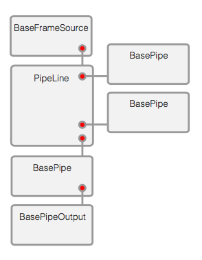

# ArPipe Framework

ArPipe is objective extension of [OpenCV](http://opencv.org) framework inspired by [ARUCO](http://www.uco.es/investiga/grupos/ava/node/26) framework. Main purpose of framework is to provide simple object interface on OpenCV functions for beginners and prepare layout and templates for AR and computer vision applications for advanced developers.

----------
## Requirements

Framework is using OpenCV2 library. For running applications based on ArPipe framework, environment that can run C++ applications.

- C++ platform
- OpenCV library

## Introduction

Main idea of framework is based on connecting image processing blocks (Pipes) into PipeLines, which creates tree structure. Each Pipes uses OpenCV functions for processing image. Pipes can be aggregated in PipeLine and every PipeLine behaves as single Pipe object, because PipeLine is extension of BasePipe.

Every single Pipe is attached to its frame source by reference, and frame source has responsibility to pass every frame to next Pipes. 

## Connecting pipes

To attach Pipe to frame source there is `addNextPipe(BasePipe* pipe)` method on every BaseFrameSource object and returns inserted pipe object to provide Fluent Interface. One BaseFrameSource can have unlimited number of following Pipes. 

	CameraFrameSource *frameSource = [[CameraFrameSource alloc] init];
    [frameSource frameSource]->addNextPipe(ArPipe::PolarRotate::init(90))
    						->addNextPipe(ArPipe::BlackAndWhite::init());

Pipes can be aggregated also into pipelines, which can not be branched, but has simplified interface.

	ArPipe::PipeLine* pipeline = new ArPipe::PipeLine([frameSource frameSource]);
    
    pipeline->addPipe(ArPipe::PolarRotate::init(90));
    pipeline->addPipe(ArPipe::BlackAndWhite::init());
    
## Creating own Pipes

### Creating Frame Sources

Each frame source must be subclass of `BaseFrameSource` class. For example, when FrameSource receives new frame from camera, it will call `pushFrameConainerToNextPipes(BaseFrameContainer *container)` method with new instance of BaseFrameContainer. Calling this method, container will be passed to following pipes.

### Creating camera data processing Pipes

Every Pipe object should be subclass of `BasePipe`. The only required step to prepare working pipe is overriding `processFrameContainer` method and implement data processing procedure in this method.

But for better experience and reusability of created Pipes, there are some recommendations for creating subclasses of `BasePipe`. 

1. Pipe object should contain static `init` method as instance factory
2. Each property of Pipe object should be set by setter, which returns reference to self instance to provide Fluent Interface.
3. Pipe object should contain default property settings

## Using framework

Currently, ArPipe framework has sandbox and connectors for use on iOs platform, but its prepared to work on every platform, which can run OpenCV framework.

For using ArPipe on iOS try download [ArPipe iOs Sandbox](https://github.com/megii/ArPipe-iOs-sandbox) and run sample code.

